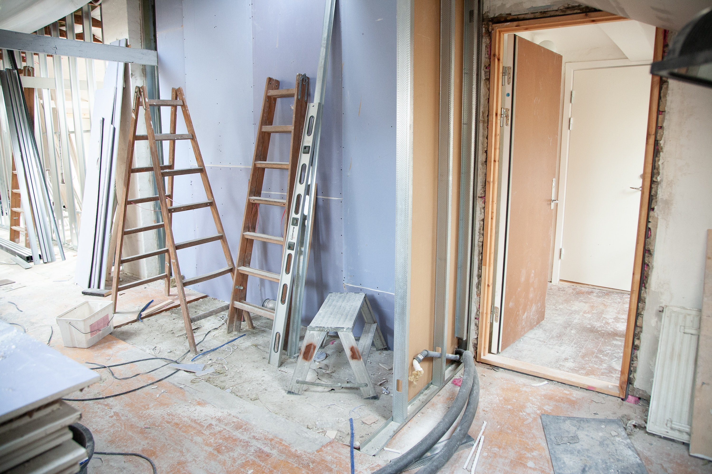

# Divide & Conquer

A **Divide & Conquer** Algorithm divides big problem into small problems and solves smaller problems.

## Building a House 🏡

A **Divide & Conquer** Algorithm divides building a house into smaller subproblems.

1. Design
2. Foundation
3. Framing
4. Plumbing, Electrical, HVAC
5. Insulate
6. Drywall
7. Flooring & Countertops
8. Trim, Doors & Fixtures

A construction site would break this subproblems into different careers by **Dividing & Conquering.**

1. Architect
2. Contractor
3. Carpenter
4. Plumbers
5. Electricians
6. Roofers
7. General Laborer

🕵♀**Divide & Conquer** is one of the most useful and common problem solving skills🕵♀

 

