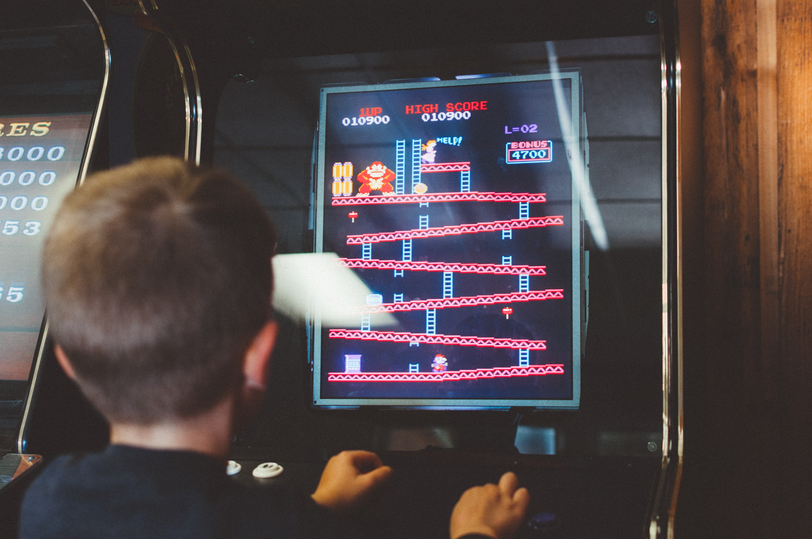

# Linked List

## What is a Linked List? ⛓ 

A **Linked List** is a sequential collection of nodes. nodes = elements

## Level Progression 🕹 

A Linked List is arranged in such a way that in order to obtain an item in the list, it must be accessed in order from start to finish. for example, hypothetically the third item is wanted. 

* 👾 👉 🤖 👉 🤡
* _The first item must be accessed, then the second, and finally the third now can be accessed._ 

🕹 In the above picture inorder for Mario to get to Donkey Kong he must travel linearly \(level by level\) up the ladders.🕹 

## How It Works 👉 👉 👉 

Pointers! The first item in the list points to the next item in the list, the second item in the list points to the third, etc, etc. Each item in the linked list has two different pieces of information: 

* _where is the next item at? \(pointer\)_
* _stored data \(value\)_

## Flavors of Linked Lists 🍨 

**Singly-Linked-List:** The access to the list is forward. 👉 

* Life: Child -&gt; Teen -&gt; Adult -&gt; Old Adult  

**Doubly-Linked-List:** The access to the list is forward or backwards.👉 👈 

* _Chain of command:  employee &lt;-&gt; local manager &lt;-&gt; regional Manager &lt;-&gt; CEO_

**Circular-Linked-List:** The access to the list is forward and infinite. The list eventually meets up with itself, creating a loop. 👉🎡 

* _Monopoly board game: the access to properties on an never ending circle, rentee torture_ 

