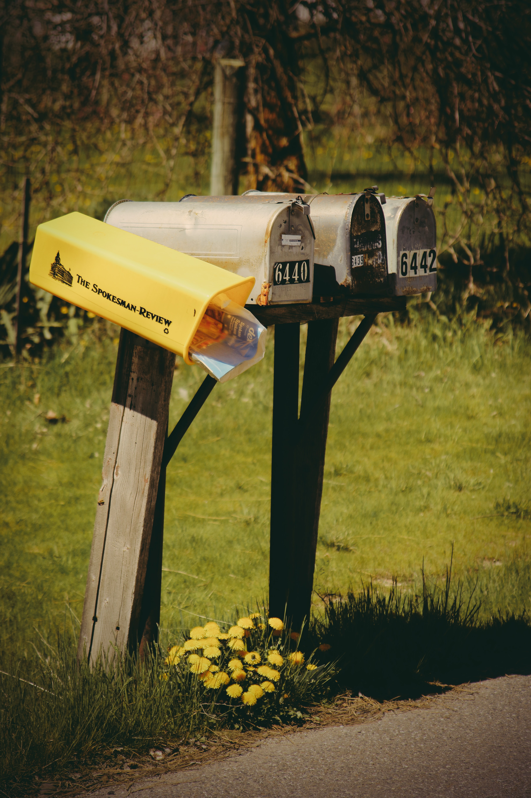

# Array

## What is an Array? 🥇 🥈 🥉 

An Array is an ordered collection of elements.

## A Row of Mailboxes📪📪📪

To access, obtain, add, or remove mail \(an item\) from the row of mailboxes \(**array**\),  the only information needed is the number to the mailbox.

## 1 dimensional 📄 , 2 dimensional 📕 , 3 dimensional 📚 

An **array** can be 1D, 2D, 3D, and beyond.

* 1D **array** would be a row of mailboxes \(left/right\)
  * 📪📪📪
* 2D **array** would be multiple rows of mailboxes \(left/right & up/down\)
  * 📪📪📪
  * 📪📪📪
  * 📪📪📪
* 3D **array** would be multiple columns of multiple rows of multiple mailboxes \(left/right & up/down & forward/backward\)
  * 📪📪📪     📪📪📪        📪📪📪
  * 📪📪📪     📪📪📪        📪📪📪
  * 📪📪📪     📪📪📪        📪📪📪        

## Stacks and Queues🍎 🍊 

Stacks and queues are examples of 1D **arrays.** Stacks & queues have a very specific and simple way to add items to the array and remove items from the array.

## Stacks 🥞 

The stack is exactly as it sounds items stacked on top of each other. Adding and removing items always occur with top of the stack

The vertical **array** utilizes the L.I.L.O. \(Last In First Out\) principal, which is the last item to get in stack is the first item to get out of the stack.

* Removal -&gt; top of the stack
* Adding -&gt;  top of the stack 
* Example: pringles, dishes, zen rock stacking 🍡 

## **Queues** 🍔 ****🚶 🚶♀ 🚶♂ 🚶 🚶♀ 🚶♂ 

The Queue is the same as a line. Adding items occurs at the beginning of the queue and removing items occurs at the end of the queue.

The horizontal **array** uses the F.I.F.O. principal \(First In First Out\) which is the first person to get in line is the first person to get out of the line, F.I.F.O.

* Removal -&gt; The end of an array
* Adding -&gt; the beginning of the array
* Example: a line for fast food, a line for a new Iphone, a line at Disneyland

