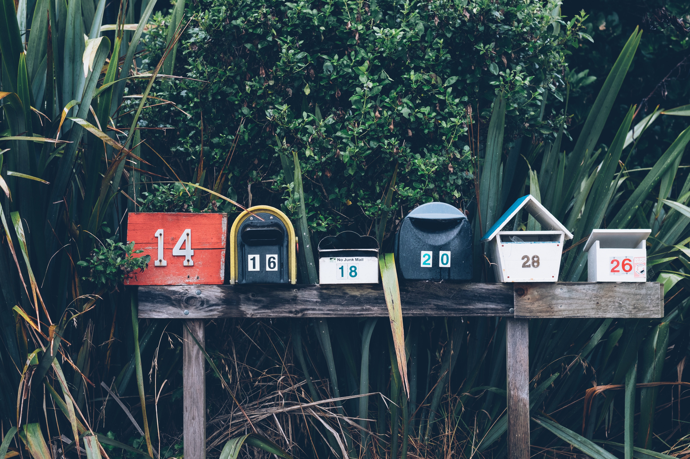

# Array

## What is an Array?

An Array is an numbered collection of items.  

## A Row of Mailboxes

To access mail \(an item\) from the row of mailboxes \(**array**\),  the only information needed would be the number of the mailbox, with this obtaining the mail, to adding to the mail, or to remove the mail is all possible. 

## 1 dimensional, 2 dimensional, 3 dimensional...

An **array** can be 1D, 2D, 3D, and beyond. A 1D **array** would be a row of mailboxes📪📪📪 because it goes only in one direction left/right. A 2D **array** the mailboxes were arranged in a left/right and up/down style like an apartment building mail system. Furthermore a 3D **array** would be multiple rows of the 2D mail systems because it goes in three directions left/right, up/down, and forward/backward. 

## Stacks and Queues

Stacks and queues are examples of 1D **arrays.** Stacks and queues have a very specific and simple way to add items to the array and remove items from the array.

## Stacks

Adding and removing items always occur with top of the stack

The stack is exactly as it sounds items stacked on top of each other. The vertical **array** utilizes the L.I.L.O. \(Last In First Out\) principal. In order to remove an item from the stack, the top must be removed and in order to add to the stack the newest item is added to the top, L.I.F.O.

Examples include: pringles, dishes, zen rock stacking, etc

## **Queues**

 Adding items occurs at the back of the queue and removing items occurs at the end of the queue.

The Queue is the same as a line: a line for fast food, a line for a new Iphone, a line for the latest and greatest fad. The horizontal **array** uses the F.I.F.O. principal \(First In First Out\) which is the first person to get in line is the first person out of the line, F.I.F.O.

